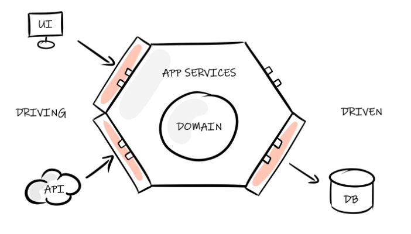

# Bank Account

🌐 Available in :
[🇫🇷 Français](README.md) | [🇬🇧 English](README.en.md)

Bank account management application built with Java 21 / Spring Boot 3, following **hexagonal architecture** principles.

---

## Functionalities

- **Current account** — creation with configurable overdraft limit, deposit and withdrawal
- **Savings account** — creation with deposit ceiling, no overdraft allowed
- **Business rules** — withdrawal rejected if balance (including overdraft) is exceeded; deposit rejected if savings ceiling is reached
- **Operations audit** — 30-day rolling history, sorted in reverse chronological order, accessible by account number

---

## Tech stack

| Layer | Technology |
|---|---|
| Language | Java 21 |
| Framework | Spring Boot 3.4.5 |
| API Documentation | springdoc-openapi (Swagger UI) |
| Testing | JUnit 5, Mockito, Spring MockMvc |
| Containerization | Docker (multi-stage build) |
| CI/CD | GitHub Actions |

---

## Architecture

The project follows **hexagonal architecture** (Ports & Adapters):

```
domain/          → pure business model (Account, CurrentAccount, SavingsAccount, BankOperation)
domain/port/     → use case interfaces (DepositUseCase, WithdrawUseCase, ...)
application/     → use case implementations (AccountService)
infrastructure/  → REST adapters (controllers, DTOs, mappers) and in-memory persistence
```

The domain has zero framework dependencies. Spring only touches the infrastructure layer.

---

## Running the application

**With Maven:**
```bash
mvn spring-boot:run
```

**With Docker:**
```bash
docker build -t bank-account .
docker run -p 8080:8080 bank-account
```

The API is available at `http://localhost:8080`.
Swagger UI is available at `http://localhost:8080/swagger-ui.html`.

---

## API

| Method | Endpoint | Description |
|---|---|---|
| POST | `/accounts` | Create a current account |
| GET | `/accounts/{accountNumber}` | Get a current account |
| POST | `/accounts/{accountNumber}/deposit` | Make a deposit |
| POST | `/accounts/{accountNumber}/withdraw` | Make a withdrawal |
| GET | `/accounts/{accountNumber}/audit` | Get operations history |
| POST | `/savings-accounts` | Create a savings account |
| GET | `/savings-accounts/{accountNumber}` | Get a savings account |
| POST | `/savings-accounts/{accountNumber}/deposit` | Make a deposit on savings |
| POST | `/savings-accounts/{accountNumber}/withdraw` | Make a withdrawal on savings |
| GET | `/savings-accounts/{accountNumber}/audit` | Get savings operations history |


